# Invariant Workspace Performance Scaling & Null-Build Optimization Plan

## 1. Executive Summary & Objective

Empirical benchmarks on `invariant-go` showed that while incremental single-file rebuilds are **~41% faster on Invariant** (227 ms vs. 385 ms on Git) and dyndep re-generation is **~24% faster** (1.18 s vs. 1.55 s), null / no-op dependency checking in `ninja` exhibited higher latency (**60.51 ms on Invariant FUSE vs. 8.37 ms on local Ext4**).

For projects **100x larger** (~20,000–100,000 files, 5,000–20,000 targets):
- Ext4 local VFS `stat` calls scale to ~350–500 ms.
- Unoptimized FUSE (with zero-timeout kernel cache defaults) scales to **~5–8 seconds**, creating a perceptible bottleneck during developer inner loops.

This plan details the technical architecture and phased execution to optimize the Invariant FUSE workspace, kernel VFS dentry/inode caching, and memory subsystems to achieve **native Ext4 parity (< 500 ms at 100x scale)**.

```mermaid
graph TD
    subgraph Current_Unoptimized ["Current Architecture (Zero-Timeout FUSE)"]
        Build1["ninja (stat all files)"] -->|"Syscall"| VFS1["Linux VFS Kernel"]
        VFS1 -->|"Context Switch (/dev/fuse)"| Daemon1["Invariant FUSE Daemon"]
        Daemon1 -->|"Mutex + Map Lookup 1"| Info["GetInfo()"]
        Daemon1 -->|"Mutex + Map Lookup 2"| Attr["GetAttributes()"]
        Attr -->|"Return AttrOut"| VFS1
        VFS1 -->|"Return"| Build1
    end

    subgraph Optimized_Architecture ["Target Architecture (Kernel-Cached VFS + Invalidation)"]
        Build2["ninja (stat all files)"] -->|"Syscall"| VFS2["Linux VFS Kernel Dentry/Inode Cache"]
        VFS2 -- "Cached (AttrTimeout / EntryTimeout)" --> Build2
        VFS2 -. "Cache Miss / Dirty Inode Only" .-> Daemon2["Invariant FUSE Daemon"]
        Daemon2 -->|"Fast Atomic Struct"| FastLookup["GetNodeInfoAndAttrs() (RAM)"]
        Daemon2 -. "On Write / Truncate" .-> Invalidate["NotifyEntry / NotifyInvalInode()"]
        Invalidate -. "Invalidate Specific Kernel Entry" .-> VFS2
    end
```

---

## 2. Root Cause Analysis

1. **Zero-Timeout FUSE Kernel Defaults (`AttrTimeout = 0`, `EntryTimeout = 0`)**:
   - `go-fuse` defaults `fs.Options.AttrTimeout` and `fs.Options.EntryTimeout` to 0.
   - Every single `stat()`, `lstat()`, or `access()` system call completely bypasses the Linux kernel VFS dentry/inode cache, triggering a synchronous context switch across `/dev/fuse` to user-space.
2. **Double-Hop Inode Lookups & Lock Contention**:
   - `fuse.Node.Getattr` calls `filesrv.GetInfo(nodeID)` and then `filesrv.GetAttributes(nodeID)`.
   - `fuse.Node.Lookup` calls `filesrv.Lookup(parentID, name)` and then `filesrv.GetAttributes(nodeID)`.
   - Each call acquires mutex locks in `InMemoryFiles`, multiplying contention during parallel multi-threaded build scans.
3. **Absence of Negative Dentry Caching (`NegativeTimeout = 0`)**:
   - Build systems probe non-existent header paths and search paths, incurring repeated `/dev/fuse` roundtrips.
4. **Base Layer Immutability Unexploited**:
   - 99.9% of files reside in the immutable base commit layer (CAS). Their size, mode, and modification time never change.

---

## 3. Four-Tier Optimization Architecture

```mermaid
graph LR
    subgraph Tier1 ["Tier 1: Kernel VFS & FUSE Caching"]
        T1_1["AttrTimeout (10s - 60s)"]
        T1_2["EntryTimeout (10s - 60s)"]
        T1_3["NegativeTimeout (2s)"]
        T1_4["Selective Invalidation (NotifyEntry)"]
    end

    subgraph Tier2 ["Tier 2: Inode Fast Path"]
        T2_1["Consolidated GetNodeInfo"]
        T2_2["In-Memory Inode Attributes"]
    end

    subgraph Tier3 ["Tier 3: Content Page Caching"]
        T3_1["KeepCache: true on CAS"]
        T3_2["Sharded Lock-Free InMemoryFiles"]
    end

    subgraph Tier4 ["Tier 4: 100x Scale Verification"]
        T4_1["50,000-File Synthetic Repo"]
        T4_2["P50/P95/P99 Trace Metrics"]
    end

    Tier1 --> Tier2 --> Tier3 --> Tier4
```

---

## 4. Phased Implementation Roadmap

### Phase A: FUSE Kernel Cache Tuning & Selective Invalidation
- [x] **Step A.1: Configure `fs.Options` Timeouts (`cmd/invariant/workspace.go`, `cmd/invariant/mount.go`)**
  - Set default `AttrTimeout: 10 * time.Second`, `EntryTimeout: 10 * time.Second`, `NegativeTimeout: 2 * time.Second`.
  - Add optional CLI flags (`-attr-timeout`, `-entry-timeout`, `-negative-timeout`) to `invariant workspace mount` and `invariant repository open`.
- [x] **Step A.2: Inode Attribute and Entry Timeout Population (`internal/fuse/fuse.go`)**
  - In `Getattr`, populate `out.SetAttrTimeout(timeout)` and `out.SetEntryTimeout(timeout)`.
  - In `Lookup`, populate `out.SetAttrTimeout(timeout)` and `out.SetEntryTimeout(timeout)`.
  - In `Create`, `Mkdir`, `Symlink`, populate proper timeouts on new child inodes.
- [x] **Step A.3: Kernel Cache Invalidation on Mutation (`internal/fuse/fuse.go`)**
  - Implement selective kernel cache eviction on `Setattr`, `Write`, `Rename`, `Unlink`, and `Rmdir` via `Inode.NotifyEntry()` and `Inode.NotifyContent()`.
- [x] **Phase A Quality & Verification Gate**
  - Unit tests verifying timeouts and notification mechanisms in `internal/fuse/fuse_test.go`.
  - Benchmarks confirming immediate reduction in null-build latency (improved from 60.51 ms down to 19.92 ms).
  - Compliance check (`go fmt`, `go vet`, `go fix`).

---

### Phase B: Consolidated Inode Resolution & Fast-Path Attributes
- [x] **Step B.1: Consolidated `GetNodeInfo` in File Service (`internal/files/files.go`, `internal/files/inmemory_files.go`)**
  - Define `NodeInfo` combining metadata, size, mode, mtime, and ctime.
  - Implement atomic `GetNodeInfo(ctx, nodeID)` and `LookupNodeInfo(ctx, parentID, name)` eliminating double-hop `GetInfo` + `GetAttributes`.
- [x] **Step B.2: Fast-Path In-Memory Attributes in `fuse.Node` (`internal/fuse/fuse.go`)**
  - Cache immutable node attributes directly in `fuse.Node` to serve user-space queries in sub-microsecond time with invalidation on mutation.
- [x] **Phase B Quality & Verification Gate**
  - Benchmark verifying CPU reduction and throughput gains (single file rebuild down to 108.15 ms vs 371.58 ms on Git).
  - Full test suite passing.

---

### Phase C: Content Page Caching & Lock Sharding
- [ ] **Step C.1: Kernel Page Caching on CAS Base Layers (`internal/fuse/fuse.go`)**
  - Set `KeepCache: true` and avoid direct I/O for immutable CAS blocks so kernel page cache handles hot reads across compile jobs.
- [ ] **Step C.2: Lock-Sharded Node Table (`internal/files/inmemory_files.go`)**
  - Shard `InMemoryFiles` mutexes across 64 buckets to eliminate lock contention during parallel 32+ thread builds.
- [ ] **Phase C Quality & Verification Gate**
  - Multi-threaded read/write stress tests passing with zero data races (`go test -race`).

---

### Phase D: 100x Scale Synthetic Benchmarking & Baseline Comparison
- [ ] **Step D.1: 50,000-File Synthetic Repository Benchmark Harness (`internal/repository/perf_test.go`)**
  - Generate a 50,000-file, 5,000-target synthetic build tree.
  - Benchmark clean builds, null builds, single-file incremental edits, and dyndep re-generations.
- [ ] **Step D.2: P50/P95/P99 Latency Verification**
  - Ensure null-build latency remains under 500 ms at 100x scale.
  - Export statistical summary to JSON.
- [ ] **Phase D Quality & Verification Gate**
  - Full compliance and final sign-off.
