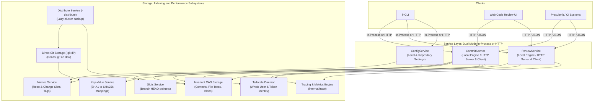
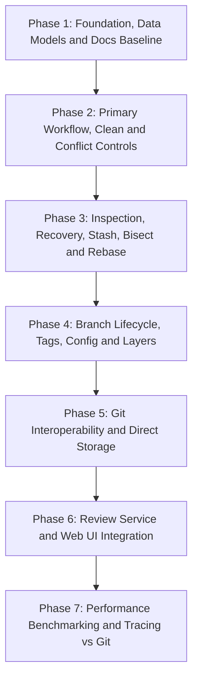
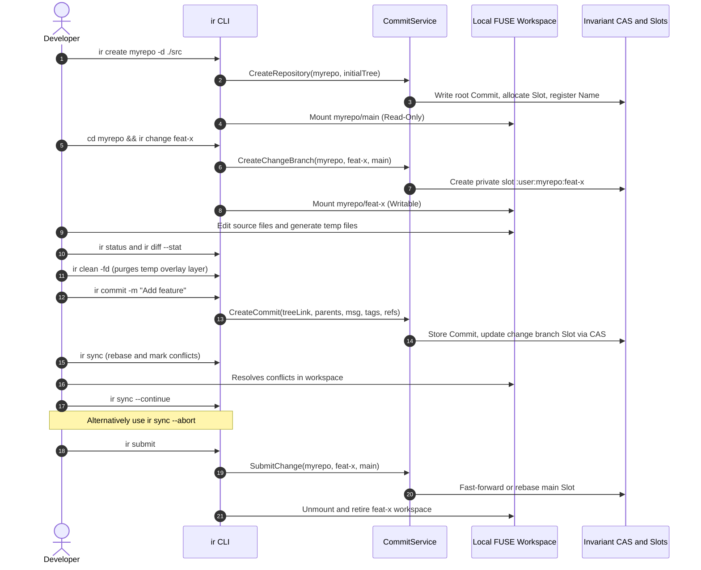
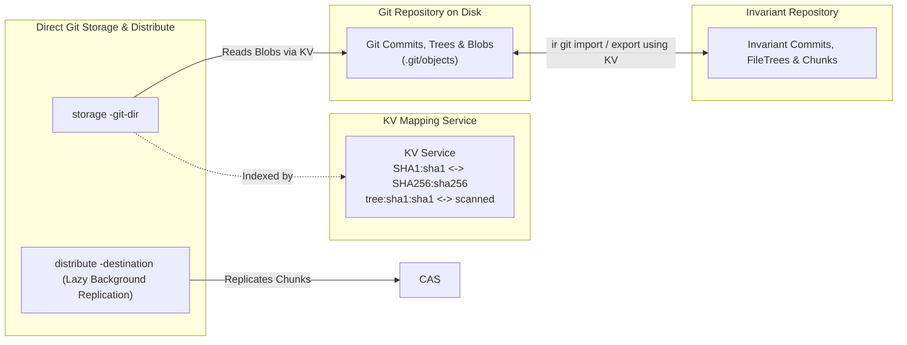
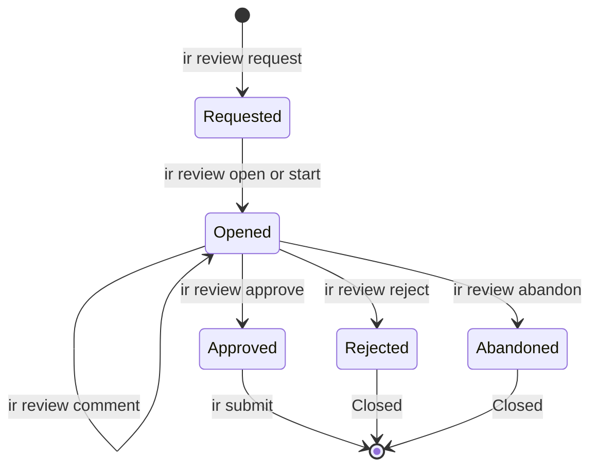
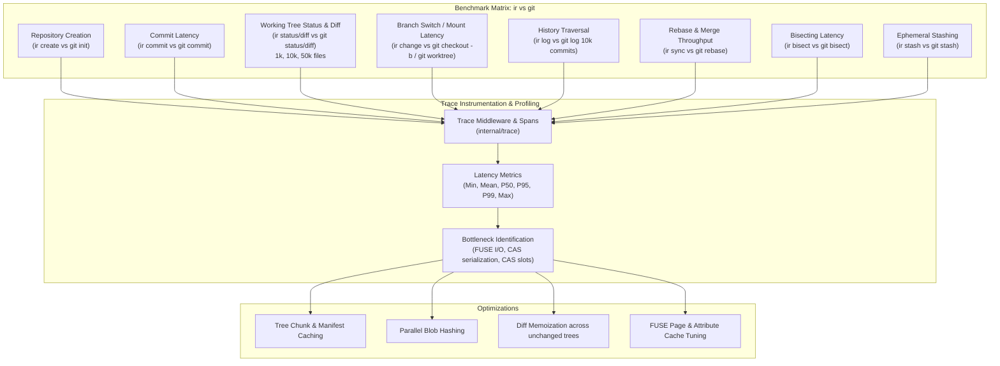

# Invariant Repository (`ir`) Implementation Plan

This document defines the architecture, data models, service interfaces, command suite, and step-by-step implementation plan for the **Invariant Repository** (`ir`) system as specified in [`docs/Repository.md`](../docs/Repository.md).

---

## 1. System Architecture & Service Design

The Invariant Repository system is built as a set of decoupled services and domain libraries on top of Invariant CAS, Slots, Names, KV, Distribute, Trace, and FUSE workspaces.

All repository and review modifications are mediated by **Service Interfaces** (`CommitService`, `ReviewService`, `ConfigService`) designed for dual-mode execution:
1. **Direct In-Process Execution**: The `ir` CLI can instantiate and execute the service engine directly in-process for standalone or local operations without requiring external daemons.
2. **HTTP Microservice & Remote Client**: The services can run as standalone HTTP daemons (advertised via Discovery) exposing JSON REST APIs consumed by the `ir` CLI, Web UIs (for browser-based code review), and CI/presubmit automation.

In addition, Git repository interoperability is enhanced through:
- **KV SHA1 $\leftrightarrow$ SHA256 Indexing**: Bidirectional object mappings populated and queried via the Key-Value service.
- **Direct Git Storage Engine (`-git-dir`)**: A storage service backend that reads blobs and trees directly from a `.git` directory on disk without copying them upfront.
- **Lazy Background Replication (`-distribute`)**: A distribute service integration that lazily uploads Git objects to cluster storage in the background.



---

## 2. Core Data Models & Schemas

### 2.1 Identity Model & Tailscale Authentication
User identity is automatically resolved from the local Tailscale client (via `tailscale.com/client/local` and `WhoIs`), falling back to OS/environment identity if unauthenticated or off-tailnet.

```go
package repository

// Identity captures user identity and authorization credentials.
type Identity struct {
    Name  string `json:"name"`
    Email string `json:"email,omitempty"`
    Token string `json:"token,omitempty"` // Tailscale auth token / credential
}
```

### 2.2 Commit Object Schema
Commits are immutable objects stored in Invariant CAS. Each commit's hash is the hex-encoded SHA-256 digest of its canonical JSON representation.

```go
// Commit represents an immutable snapshot and history node.
type Commit struct {
    // Tree is the content link pointing to the root file tree of this commit snapshot.
    Tree content.ContentLink `json:"tree"`

    // Parents contains the SHA256 hashes of parent commit(s).
    Parents []string `json:"parents,omitempty"`

    // Author is the identity of the commit author.
    Author Identity `json:"author"`

    // Committer is the identity of the committer.
    Committer Identity `json:"committer"`

    // Message is the commit message description.
    Message string `json:"message"`

    // Timestamp is the Unix timestamp (seconds) when the commit was created.
    Timestamp int64 `json:"timestamp"`

    // Tags is an arbitrary string-to-string map for metadata tags and labels.
    // Examples:
    //   Tags["review"] = "<token>"      (associates commit with a review token)
    //   Tags["git-commit"] = "<sha1>"   (maps to corresponding Git commit SHA)
    //   Tags["stash"] = "<timestamp>"   (marks commit as an ephemeral stash entry)
    //   Tags["signed-off-by"] = "..."
    Tags map[string]string `json:"tags,omitempty"`

    // Refs maps reference names to commit SHA256 hashes.
    // Used to track commit update history, previous iterations, amendments, or revision links.
    // Examples:
    //   Refs["supersedes"] = "<previous_commit_sha>"
    //   Refs["base-origin"] = "<upstream_base_commit_sha>"
    //   Refs["cherry-picked-from"] = "<orig_sha>"
    //   Refs["reverts"] = "<reverted_commit_sha>"
    Refs map[string]string `json:"refs,omitempty"`
}
```

### 2.3 Repository Metadata Schema
Stored in a dedicated repository slot registered in the Names Service under `<repository_name>`. The repository name is defined by the Names Service registration key and is omitted from the configuration body to avoid duplication.

```go
type RepositoryConfig struct {
    DefaultBranch  string            `json:"defaultBranch"` // e.g., "main"
    MainSlotID     string            `json:"mainSlotId"`    // Slot ID backing main branch
    Encrypted      bool              `json:"encrypted,omitempty"`
    Compressed     bool              `json:"compressed,omitempty"`
    WriteTag       string            `json:"writeTag,omitempty"`
    ReviewRequired bool              `json:"reviewRequired,omitempty"`
    Layers         []LayerDependency `json:"layers,omitempty"`
    Settings       map[string]string `json:"settings,omitempty"`
    CreatedAt      int64             `json:"createdAt"`
}

type LayerDependency struct {
    Repository string `json:"repository"`
    Path       string `json:"path"`
    Commit     string `json:"commit,omitempty"`
}
```

### 2.4 Review Data Schema
Matching the TypeScript specification in `docs/Repository.md`:

```go
type Comment struct {
    Comment string `json:"comment"`
    Author  string `json:"author,omitempty"`
    Branch  string `json:"branch,omitempty"`
}

type ReviewComment struct {
    Comments  []Comment `json:"comments"`
    File      string    `json:"file,omitempty"`
    Offset    *int      `json:"offset,omitempty"`
    Len       *int      `json:"len,omitempty"`
    StartLine *int      `json:"startLine,omitempty"`
    EndLine   *int      `json:"endLine,omitempty"`
    Resolved  bool      `json:"resolved,omitempty"`
}

type ReviewStatus string

const (
    ReviewStatusPending   ReviewStatus = "pending"
    ReviewStatusApproved  ReviewStatus = "approved"
    ReviewStatusRejected  ReviewStatus = "rejected"
    ReviewStatusAbandoned ReviewStatus = "abandoned"
)

type ReviewRecord struct {
    Token        string          `json:"token"`
    RepoName     string          `json:"repoName"`
    BranchName   string          `json:"branchName"`
    ChangeSlotID string          `json:"changeSlotId"`
    BaseCommit   string          `json:"baseCommit"`
    HeadCommit   string          `json:"headCommit"`
    Status       ReviewStatus    `json:"status"`
    Reviewer     string          `json:"reviewer,omitempty"`
    Comments     []ReviewComment `json:"comments,omitempty"`
    CreatedAt    int64           `json:"createdAt"`
    UpdatedAt    int64           `json:"updatedAt"`
}
```

---

## 3. Service Interfaces

### 3.1 `CommitService` Interface
Controls creating, reading, validating, rebasing, restoring, blaming, bisecting, and updating commits and branch slots.

```go
package repository

import "context"

type CreateCommitRequest struct {
    RepoName    string              `json:"repoName"`
    BranchName  string              `json:"branchName"`
    TreeLink    content.ContentLink `json:"treeLink"`
    Parents     []string            `json:"parents"`
    Message     string              `json:"message"`
    Author      Identity            `json:"author"`
    Tags        map[string]string   `json:"tags,omitempty"`
    Refs        map[string]string   `json:"refs,omitempty"`
}

type SubmitRequest struct {
    RepoName       string   `json:"repoName"`
    ChangeBranch   string   `json:"changeBranch"`
    TargetBranch   string   `json:"targetBranch"`
    ExpectedTarget string   `json:"expectedTarget,omitempty"`
    Author         Identity `json:"author"`
}

type SubmitResponse struct {
    NewHeadCommit string   `json:"newHeadCommit"`
    Squashed      bool     `json:"squashed"`
    Conflicts     []string `json:"conflicts,omitempty"`
}

type BlameLine struct {
    LineNumber int      `json:"lineNumber"`
    Content    string   `json:"content"`
    CommitHash string   `json:"commitHash"`
    Author     Identity `json:"author"`
    Timestamp  int64    `json:"timestamp"`
}

type DiffStat struct {
    FilesChanged int      `json:"filesChanged"`
    Insertions   int      `json:"insertions"`
    Deletions    int      `json:"deletions"`
    Details      []string `json:"details"`
}

type CommitService interface {
    // GetCommit retrieves a commit by its SHA256 hash.
    GetCommit(ctx context.Context, commitHash string) (*Commit, error)

    // CreateCommit creates an immutable commit in CAS and updates the branch slot via CAS.
    CreateCommit(ctx context.Context, req CreateCommitRequest) (*Commit, string, error)

    // GetHistory returns commit history along the first-parent spine or full DAG, optionally filtered by path.
    GetHistory(ctx context.Context, headHash string, spineOnly bool, pathFilter string) ([]*Commit, []string, error)

    // ComputeDiff calculates unified diff and statistics between two commit trees or workspace against a commit.
    ComputeDiff(ctx context.Context, fromTree, toTree content.ContentLink) (string, DiffStat, error)

    // SyncBranch performs a 3-way rebase of changeBranch onto targetBranch HEAD.
    SyncBranch(ctx context.Context, repoName, changeBranch string) (string, []string, error)

    // AbortSync restores the branch workspace to the pre-sync state.
    AbortSync(ctx context.Context, repoName, changeBranch string) error

    // SubmitChange validates prerequisites, fast-forwards/rebases, and updates target branch slot.
    SubmitChange(ctx context.Context, req SubmitRequest) (*SubmitResponse, error)

    // Blame computes line-by-line commit attribution for a file.
    Blame(ctx context.Context, commitHash, filePath string) ([]BlameLine, error)

    // Bisect computes the next candidate midpoint commit between good and bad commits.
    Bisect(ctx context.Context, goodCommits, badCommits []string) (string, int, error)

    // InteractiveRebase applies an edited commit plan (reorder, squash, edit, drop) onto a base.
    InteractiveRebase(ctx context.Context, repoName, changeBranch, baseCommit string, plan []RebaseAction) (string, error)
}

type RebaseActionType string

const (
    RebasePick   RebaseActionType = "pick"
    RebaseSquash RebaseActionType = "squash"
    RebaseEdit   RebaseActionType = "edit"
    RebaseDrop   RebaseActionType = "drop"
    RebaseReword RebaseActionType = "reword"
)

type RebaseAction struct {
    Type       RebaseActionType `json:"type"`
    CommitHash string           `json:"commitHash"`
    NewMessage string           `json:"newMessage,omitempty"`
}
```

### 3.2 `ReviewService` Interface
Controls the review lifecycle, review tokens, and comment threads for both CLI and Web UI.

```go
type ReviewService interface {
    // RequestReview creates a review record for a change branch and emits a unique review token.
    RequestReview(ctx context.Context, repoName, branchName string, author Identity) (*ReviewRecord, error)

    // GetReview retrieves review metadata and comment threads by token, commit hash, or branch name.
    GetReview(ctx context.Context, identifier string) (*ReviewRecord, error)

    // AddComments appends or updates structured comments on a review.
    AddComments(ctx context.Context, token string, comments []ReviewComment, author Identity) error

    // ApproveReview marks the review as approved.
    ApproveReview(ctx context.Context, token string, reviewer Identity) error

    // RejectReview marks the review as rejected.
    RejectReview(ctx context.Context, token string, reviewer Identity) error

    // AbandonReview marks the review as abandoned.
    AbandonReview(ctx context.Context, token string, author Identity) error
}
```

---

## 4. Documentation & Plan Maintenance Strategy

### 4.1 Specification Maintenance (`docs/Repository.md`)
[`docs/Repository.md`](../docs/Repository.md) serves as the living technical specification for the Invariant Repository system. To maintain documentation integrity throughout execution:

1. **Initial Baseline**: At the start of Phase 1, `Repository.md` is audited, all grammar/phrasing issues are corrected, architecture clarifications (`Tags`, `Refs`, Tailscale `Identity`, service interfaces, new commands) are updated, and all commands are marked with `**Status:** Unimplemented`.
2. **Phase Completion Status Updates**: As each command is fully implemented and passes its quality/verification gate in subsequent phases, its status in `Repository.md` is updated to `**Status:** Implemented`.
3. **Plan Evolution Synchronization**: Any architectural refinements or flag adjustments identified during development will be kept synchronized across both this plan and `Repository.md`.

### 4.2 Project Plan Persistence (`plans/repository_implementation_plan.md`)
To guarantee that the implementation plan remains authoritative and accessible across multi-turn executions and context resets:
1. **Repository Storage**: The master implementation plan is stored in the repository at `plans/repository_implementation_plan.md`.
2. **Continuous Updates**: As each step and phase is executed, `plans/repository_implementation_plan.md` will be updated directly in the codebase with checked task boxes (`[x]`), status summaries, and any architectural adjustments.
3. **Context Re-hydration Reference**: If context is compacted, cleared, or lost during multi-step execution, any agent or developer can immediately inspect `plans/repository_implementation_plan.md` to restore full situational awareness, see which steps have completed, and resume execution seamlessly without ambiguity.

---

## 5. Multi-Step Implementation Plan

The plan is divided into 7 sequential phases, prioritizing primary workflows, history/recovery tools, branch lifecycle, Git interop, code review, and performance benchmarking. Every phase embeds an explicit **Quality, Testing & Verification Gate**.



---

### Phase 1: Foundation, Data Models, Service Interfaces & Documentation Baseline

#### Objective
Establish core domain models (`Commit` with `Tags` and `Refs`, `Identity` with Tailscale `Token`, `RepositoryConfig`), service interfaces (`CommitService`, `ReviewService`), storage/naming primitives, initialize `plans/repository_implementation_plan.md`, and update `docs/Repository.md` with baseline status annotations and grammar corrections.

- [x] **Step 1.1: Core Types & Serialization (`internal/repository/types.go`)**
  - Implement `Commit`, `Identity`, `RepositoryConfig`, `ReviewRecord`, `ReviewComment`, `BlameLine`, `DiffStat`, `RebaseAction`.
  - Add `Tags map[string]string` and `Refs map[string]string` to `Commit`.
  - Implement canonical JSON serialization and deterministic SHA-256 commit address hashing.
  - Implement CAS read/write encoders.

- [x] **Step 1.2: Extensible Identity Providers (`internal/repository/identity.go`, `internal/repository/identity_tailscale.go`)**
  - Implement generic `IdentityProvider` interface and `EnvironmentIdentityProvider` with `MultiIdentityProvider` chaining.
  - Implement `TailscaleIdentityProvider` using `tailscale.com/client/local` to extract logged-in user name, email, and authentication token.
  - Support easy extension for future identity backends.

- [x] **Step 1.3: Slot & Name Management (`internal/repository/naming.go`)**
  - Implement naming conventions:
    - Repository config & main branch: `<repo_name>`
    - Change branch: `:<user>:<repo_name>:<change_name>`
    - Release tag: `<repo_name>:tags:<tag_name>`
  - Implement slot allocation, registration, and Compare-And-Swap (CAS) update helpers.

- [x] **Step 1.4: Service Interface Submodules (`internal/repository/commit/service.go`, `internal/repository/review/service.go`, `internal/repository/config/service.go`)**
  - Define `commit.Service` and request/response payload structs in sub-module `internal/repository/commit/`.
  - Define `review.Service` and review data structs in sub-module `internal/repository/review/`.
  - Define `config.Service` in sub-module `internal/repository/config/`.

- [x] **Step 1.5: Plan Persistence & `Repository.md` Baseline Audit**
  - Create directory `plans/` and write master plan to `plans/repository_implementation_plan.md`.
  - Update `docs/Repository.md`:
    - Correct grammar and spelling throughout the document.
    - Annotate every command section with `**Status:** Unimplemented`.
    - Document all added commands (`restore`, `revert`, `blame`, `show`, `grep`, `diff`, `clean`, `stash`, `bisect`, `rebase -i`, `branch`, `tag`, `config`, `layer`, `checkout`, `sync --continue/--abort`).
    - Update specifications for `Tags`, `Refs`, Tailscale `Token`, and dual-mode service architecture.

- [x] **Phase 1 Quality & Verification Gate**
  - Unit tests in `internal/repository/commit_test.go` and `internal/repository/naming_test.go`.
  - Verify compliance with `go fmt`, `go vet`, and `go fix`.
  - Ensure all exported symbols have standard Go doc comments.
  - Update `plans/repository_implementation_plan.md` with Phase 1 completion status.

---

### Phase 2: Primary Workflow, Workspace Hygiene & Conflict Controls

#### Objective
Implement `CommitService` (both local in-process engine and HTTP service/client), primary CLI workflow commands (`create`, `change`, `status`, `diff`, `clean`, `commit`, `sync`, `submit`), range diffs with `--stat`, workspace overlay layer cleaning (`ir clean`), and interactive sync conflict controls (`--continue`, `--abort`).



- [x] **Step 2.1: `CommitService` Local & HTTP Implementation (`internal/repository/commit/`)**
  - Implement `LocalService` executing commit operations directly against CAS and Slots.
  - Implement HTTP handlers (`POST /api/v1/commit`, `GET /api/v1/commit/{sha}`, `GET /api/v1/history`, `POST /api/v1/sync`, `POST /api/v1/submit`, `POST /api/v1/diff`, `GET /api/v1/blame`, `POST /api/v1/bisect`, `POST /api/v1/rebase`).
  - Implement `Client` implementing `commit.Service` over HTTP.

- [x] **Step 2.2: `ir create <name> [<content>]` (`internal/repository/create.go`, `cmd/invariant/repository.go`)**
  - Parse CLI arguments: `<name>`, initial content or `-d=<path>`, `-create-only`, `-encrypt`, `-compress`, `-writable`.
  - Create initial commit, main branch slot, and Names registration via `commit.Service`.
  - Mount workspace directory `<name>/main` (read-only by default, or writable if `-writable`).
  - Update `docs/Repository.md`: mark `ir create` as `**Status:** Implemented`.

- [x] **Step 2.3: `ir change <name>` (`internal/repository/change.go`)**
  - Flag: `-private`.
  - Allocate change slot pointing to upstream HEAD commit.
  - Register `:<user>:<repo_name>:<name>` in Names service unless `-private`.
  - Mount writable workspace at `<repo_root>/<name>`.
  - Update `docs/Repository.md`: mark `ir change` as `**Status:** Implemented`.

- [x] **Step 2.4: `ir status`, `ir diff` & `ir clean` (`internal/repository/status.go`, `internal/repository/diff.go`, `internal/repository/clean.go`)**
  - `status`: Compare workspace active tree to HEAD commit tree; show Added, Modified, Deleted files.
  - `diff [<commit1>] [<commit2>] [--stat]`:
    - Diffs working tree vs HEAD, working tree vs arbitrary commit, or `<commit1>` vs `<commit2>`.
    - Supports `ir diff <branch>...` (3-dot merge-base diff against upstream).
    - Supports `--stat` summary output showing files changed and lines added/deleted.
  - `clean [-f] [-d] [-x]`:
    - Resets and purges uncommitted temporary/ignored files in the local workspace overlay layer without modifying tracked source edits.
  - Update `docs/Repository.md`: mark `ir status`, `ir diff`, and `ir clean` as `**Status:** Implemented`.

- [x] **Step 2.5: `ir commit` (`internal/repository/commit_cmd.go`)**
  - Options: `-m <msg>` (repeatable, newline concatenated), `-e` / `-edit`, `-no-edit`, `-amend`.
  - Snapshot working tree; launch editor if no `-m` and not `-no-edit`.
  - Call `CommitService.CreateCommit`:
    - Populate `Author` (with Tailscale identity/token).
    - Set `Refs["supersedes"]` if amending.
    - Update change branch slot via CAS.
  - Update `docs/Repository.md`: mark `ir commit` as `**Status:** Implemented`.

- [x] **Step 2.6: `ir sync` with Conflict Lifecycle Controls (`internal/repository/sync.go`)**
  - Route through `CommitService.SyncBranch`.
  - Perform 3-way merge on file trees using [`workspace.MergeTrees`](file:///home/chuckjaz/src/invariant-go/internal/workspace/workspace.go#L300-L440).
  - Write standard conflict markers (`<<<<<<<`, `=======`, `>>>>>>>`) if conflicts exist.
  - Support `ir sync --abort`: restore workspace cleanly to pre-sync commit.
  - Support `ir sync --continue`: verify all conflict markers are resolved, snapshot tree, and finalize rebased commit.
  - Update `docs/Repository.md`: mark `ir sync` as `**Status:** Implemented`.

- [x] **Step 2.7: `ir submit [<directory>]` (`internal/repository/submit.go`)**
  - Route through `CommitService.SubmitChange`.
  - Validate branch criteria (e.g. check approved review status if required).
  - Fast-forward or rebase onto upstream branch.
  - Unmount and retire `<repo_root>/<name>` workspace.
  - Update `docs/Repository.md`: mark `ir submit` as `**Status:** Implemented`.

- [x] **Phase 2 Quality & Verification Gate**
  - End-to-end integration test in `internal/repository/workflow_test.go` covering `create` $\to$ `change` $\to$ `clean` $\to$ `diff --stat` $\to$ `commit` $\to$ conflict resolution with `--continue`/`--abort` $\to$ `submit`.
  - Verify compliance with `go fmt`, `go vet`, and `go fix`.
  - Full Go doc comments on all new exported APIs.
  - Update `plans/repository_implementation_plan.md` with Phase 2 completion status.

---

### Phase 3: Inspection, Recovery, Stashing, Bisecting & History Grooming

#### Objective
Implement log history traversal (including path filtering), commit/file inspection (`show`), uncommitted change discarding (`restore`), inverse commits (`revert`), line attribution (`blame`), history content searching (`grep`), ephemeral shelving (`stash`), automated binary search regression hunting (`bisect`), interactive commit history grooming (`rebase -i`), cherry-picking, repository mounting/unmounting, and standalone CLI binary aliasing.

- [ ] **Step 3.1: `ir log [<path>]` (`internal/repository/log.go`)**
  - Fetch commits via `CommitService.GetHistory`.
  - Default: Spine log (first-parent traversal) with commit hash, author, timestamp, tags, refs, message.
  - Support path filtering: `ir log <path>` shows only commits modifying the specified file or directory.
  - Support `--tree` and `--graph` options for full DAG visualization.
  - Update `docs/Repository.md`: mark `ir log` as `**Status:** Implemented`.

- [ ] **Step 3.2: `ir show <commit>[:<path>]` (`internal/repository/show.go`)**
  - Inspect full commit metadata, author, timestamp, tags, refs, and unified diff.
  - If `<commit>:<path>` provided: output the file contents as they existed in that commit snapshot without mounting.
  - Update `docs/Repository.md`: mark `ir show` as `**Status:** Implemented`.

- [ ] **Step 3.3: `ir restore [<path>]` (`internal/repository/restore.go`)**
  - Discard uncommitted local workspace edits.
  - Restore specific `<path>` (or entire working tree) directly from current HEAD commit's file tree.
  - Update `docs/Repository.md`: mark `ir restore` as `**Status:** Implemented`.

- [ ] **Step 3.4: `ir revert <commit>` (`internal/repository/revert.go`)**
  - Compute the inverse patch of the specified `<commit>`.
  - Apply 3-way inverse merge onto current workspace and create a new commit recording `Refs["reverts"] = "<commit_sha>"`.
  - Update `docs/Repository.md`: mark `ir revert` as `**Status:** Implemented`.

- [ ] **Step 3.5: `ir blame <file>` (`internal/repository/blame.go`)**
  - Line-by-line attribution: Walk the commit graph backwards to trace the origin commit, author, timestamp, and line content for each line of `<file>`.
  - Update `docs/Repository.md`: mark `ir blame` as `**Status:** Implemented`.

- [ ] **Step 3.6: `ir grep <pattern>` (`internal/repository/grep.go`)**
  - Search file contents for string or regex patterns across the current commit tree or historical commits directly in CAS.
  - Update `docs/Repository.md`: mark `ir grep` as `**Status:** Implemented`.

- [ ] **Step 3.7: `ir stash [push|pop|list|drop]` (`internal/repository/stash.go`)**
  - `ir stash` / `ir stash push [-m <msg>]`:
    - Snapshots working tree changes into an ephemeral CAS commit object tagged with `Tags["stash"] = "<timestamp>"`.
    - Pushes commit hash onto local workspace stash stack and restores working tree to clean HEAD.
  - `ir stash pop`:
    - Pops latest stash commit, applies 3-way patch onto working tree, and removes stash entry.
  - `ir stash list` & `ir stash drop [<index>]`: Inspect and manage stash stack.
  - Update `docs/Repository.md`: mark `ir stash` as `**Status:** Implemented`.

- [ ] **Step 3.8: `ir bisect [start|good|bad|run]` (`internal/repository/bisect.go`)**
  - `ir bisect start`, `ir bisect bad [<commit>]`, `ir bisect good [<commit>]`:
    - Calculates topological midpoint commit between good and bad boundary commits in the DAG.
    - Mounts/points workspace to candidate commit for testing.
  - `ir bisect run <script>`:
    - Automatically executes test script at each midpoint step until culprit commit is identified.
  - Update `docs/Repository.md`: mark `ir bisect` as `**Status:** Implemented`.

- [ ] **Step 3.9: Interactive Rebase & History Grooming (`internal/repository/rebase_i.go`)**
  - `ir rebase -i [<upstream>]`:
    - Generates interactive action sheet (`pick`, `squash`, `edit`, `drop`, `reword`) for commits in private change branch.
    - Opens editor; applies actions sequentially to construct cleaned, atomic commit history.
  - `ir commit --squash=<commit>`:
    - Direct shortcut to fold current working tree changes into an earlier commit in the change set.
  - Update `docs/Repository.md`: mark `ir rebase -i` as `**Status:** Implemented`.

- [ ] **Step 3.10: `ir cherry-pick <branch|commit> [<commit>]` (`internal/repository/cherry_pick.go`)**
  - If branch: cherry-pick non-converged commits.
  - If single commit or commit range `<commit1> <commit2>`: compute diff against parent and apply 3-way tree merge onto current branch.
  - Create new commit(s) on current branch recording `Refs["cherry-picked-from"] = "<orig_sha>"`.
  - Update `docs/Repository.md`: mark `ir cherry-pick` as `**Status:** Implemented`.

- [ ] **Step 3.11: `ir mount` & `ir unmount` (`internal/repository/mount.go`)**
  - `ir mount [<directory>]`: Mount repository root workspace.
  - `ir unmount <directory>`: Recursively unmount repository root and all active nested branch workspaces.
  - Update `docs/Repository.md`: mark `ir mount` and `ir unmount` as `**Status:** Implemented`.

- [ ] **Step 3.12: Standalone Binary Alias (`cmd/ir/main.go`)**
  - Provide `cmd/ir/main.go` aliasing directly to repository commands for native `ir` command usage.

- [ ] **Phase 3 Quality & Verification Gate**
  - Unit and integration tests in `log_test.go`, `show_test.go`, `restore_test.go`, `revert_test.go`, `blame_test.go`, `grep_test.go`, `stash_test.go`, `bisect_test.go`, `rebase_i_test.go`, `cherry_pick_test.go`.
  - Compliance check (`go fmt`, `go vet`, `go fix`).
  - Documentation check.
  - Update `plans/repository_implementation_plan.md` with Phase 3 completion status.

---

### Phase 4: Branch Lifecycle, Peer Collaboration, Release Tagging, Config & Composition

#### Objective
Implement comprehensive branch management (`branch list`, `branch delete`), peer change collaboration (`checkout` peer branch), immutable release tagging (`tag create`, `tag list`, `tag delete`), repository/user configuration management (`config`), and sub-repository layer composition (`layer`).

- [ ] **Step 4.1: `ir branch [list|delete]` (`internal/repository/branch_cmd.go`)**
  - `ir branch` / `ir branch list`:
    - List local mounted workspaces and upstream branches.
    - Query Names Service for all published peer branches matching `:<user>:<repo_name>:*`.
    - Display branch names, tracking upstream, and current HEAD commit summaries.
  - `ir branch delete <name>`:
    - Unmount local workspace if mounted.
    - Unregister `:<user>:<repo_name>:<name>` from Names Service.
    - Clean up branch directory.
  - Update `docs/Repository.md`: mark `ir branch` as `**Status:** Implemented`.

- [ ] **Step 4.2: `ir checkout <branch|peer-branch>` (`internal/repository/checkout.go`)**
  - Allow checking out / mounting a peer's published change branch (e.g. `ir checkout :alice:myrepo:feat-x`).
  - Resolves peer slot from Names Service, creates local workspace directory `<repo_root>/feat-x`, and mounts it locally.
  - Update `docs/Repository.md`: mark `ir checkout` as `**Status:** Implemented`.

- [ ] **Step 4.3: `ir tag [create|list|delete]` (`internal/repository/tag_cmd.go`)**
  - `ir tag create <name> [<commit>]`: Create an immutable named release pointer pointing to `<commit>` (default: current HEAD) registered in Names Service under `<repo_name>:tags:<name>`.
  - `ir tag list`: List all release tags and target commit hashes for the repository.
  - `ir tag delete <name>`: Delete release tag from Names Service.
  - Update `docs/Repository.md`: mark `ir tag` as `**Status:** Implemented`.

- [ ] **Step 4.4: `ir config [get|set|list|unset]` (`internal/repository/config_cmd.go`)**
  - Manage configuration settings at repository scope (stored in `RepositoryConfig.Settings`) or global user scope (`~/.invariant/config.json`).
  - Configure default branch policies, write tags, author details, editor preferences, review requirement rules, and custom diff/merge settings.
  - Update `docs/Repository.md`: mark `ir config` as `**Status:** Implemented`.

- [ ] **Step 4.5: Sub-Repository Layer Composition (`ir layer`) (`internal/repository/layer_cmd.go`)**
  - `ir layer add <repository_name> <mount_path> [--commit=<sha>]`:
    - Pins another Invariant repository as a read-only or shared dependency layer in `.invariant-layer` / `.invariant-share`.
  - `ir layer list` & `ir layer remove <mount_path>`:
    - View and manage pinned sub-repository layers.
  - Update `docs/Repository.md`: mark `ir layer` as `**Status:** Implemented`.

- [ ] **Phase 4 Quality & Verification Gate**
  - Multi-user collaboration tests in `internal/repository/branch_test.go`, `tag_test.go`, `config_test.go`, `layer_test.go`.
  - Compliance check (`go fmt`, `go vet`, `go fix`).
  - Documentation check.
  - Update `plans/repository_implementation_plan.md` with Phase 4 completion status.

---

### Phase 5: Git Interoperability, KV Object Mapping & Direct Storage

#### Objective
Implement bidirectional conversion between Git repositories and Invariant repositories, leverage and update the KV service SHA1 $\leftrightarrow$ SHA256 object index (from `scan_repo` / `internal/gitscan`), enable a direct `.git` storage service backend, and support lazy background distribution.



- [ ] **Step 5.1: Bidirectional Git SHA1 $\leftrightarrow$ Invariant SHA256 KV Object Mapping Engine (`internal/repository/git_kv.go`)**
  - Integrate with `internal/gitscan` and `internal/kv` conventions:
    - `SHA1:<git_blob_sha1>` $\to$ `<invariant_sha256_hex>`
    - `SHA256:<invariant_sha256_hex>` $\to$ `<git_blob_sha1>`
    - `tree:sha1:<git_tree_sha1>` $\to$ `<invariant_filetree_sha256_hex>`
  - During import and export, batch-query KV to reuse existing object conversions, avoiding redundant hashing and storage duplication.
  - Index newly converted blobs and trees into KV in batches.

- [ ] **Step 5.2: `ir git import` & `ir git export` (`internal/repository/git_import.go`, `internal/repository/git_export.go`)**
  - `ir git import [<repository directory>]`:
    - Walk Git commit history using `github.com/go-git/go-git/v5`.
    - Map Git trees to Invariant [`filetree.Directory`](file:///home/chuckjaz/src/invariant-go/internal/filetree/filetree.go#L60) using KV mappings.
    - Write Invariant `Commit` objects with `Tags["git-commit"] = "<git_sha>"`.
    - Point current branch slot to imported HEAD.
  - `ir git export [<repository directory>]`:
    - Traverse Invariant commit DAG; generate Git blobs, trees, and commits.
    - Update Git branch reference to exported HEAD.
  - Update `docs/Repository.md`: mark `ir git import` and `ir git export` as `**Status:** Implemented`.

- [ ] **Step 5.3: Direct Git Storage Service Option (`-git-dir`) (`cmd/storage/main.go`)**
  - Add `-git-dir` flag to [`cmd/storage/main.go`](file:///home/chuckjaz/src/invariant-go/cmd/storage/main.go).
  - When `-git-dir` is passed:
    - Instantiate [`git.NewGitStorage`](file:///home/chuckjaz/src/invariant-go/internal/storage/git/git_storage.go#L98) with KV service client.
    - Read blobs and objects directly from the local `.git` repository on demand without copying them into standard storage.

- [ ] **Step 5.4: Lazy Background Distribute Service Integration (`-distribute`)**
  - Connect a distribute service ([`cmd/distribute/main.go`](file:///home/chuckjaz/src/invariant-go/cmd/distribute/main.go)) with the direct Git storage service.
  - Distribute service monitors newly referenced blocks and lazily uploads them to Invariant cluster storage in the background.

- [ ] **Phase 5 Quality & Verification Gate**
  - Lossless bidirectional roundtrip tests in `internal/repository/git_interop_test.go` (Git $\to$ Invariant $\to$ Git).
  - Storage integration tests verifying `-git-dir` and `-distribute` serving and replicating objects.
  - Compliance check (`go fmt`, `go vet`, `go fix`).
  - Documentation check.
  - Update `plans/repository_implementation_plan.md` with Phase 5 completion status.

---

### Phase 6: Code Review Service & Web UI Integration

#### Objective
Implement `ReviewService` (in-process and HTTP REST API), review token generation (stored as `Tags["review"]`), comment threading, suggestion side-branches, and submit gating.



- [ ] **Step 6.1: `ReviewService` Local & HTTP REST Server (`internal/repository/review_service.go`, `internal/repository/review_server.go`, `internal/repository/review_client.go`)**
  - Implement `LocalReviewService` managing review records and comment trees in CAS.
  - Implement HTTP REST endpoints:
    - `POST /api/v1/reviews/request`: Create review record, return token and URL.
    - `GET /api/v1/reviews/{token}`: Retrieve review metadata and comments.
    - `POST /api/v1/reviews/{token}/comments`: Add/update comments.
    - `POST /api/v1/reviews/{token}/approve`: Approve review.
    - `POST /api/v1/reviews/{token}/reject`: Reject review.
    - `POST /api/v1/reviews/{token}/abandon`: Abandon review.
  - Implement `RemoteReviewClient` implementing `ReviewService`.

- [ ] **Step 6.2: `ir review request [<directory>]` (`internal/repository/review_request.go`)**
  - Call `ReviewService.RequestReview`.
  - Add tag `Tags["review"] = "<token>"` to the change branch HEAD commit via `CommitService`.
  - Return review token and Web UI review URL.
  - Update `docs/Repository.md`: mark `ir review request` as `**Status:** Implemented`.

- [ ] **Step 6.3: `ir review open` & `ir review start` (`internal/repository/review_open.go`)**
  - Resolve review record by SHA, token, or name.
  - Create review workspace directory.
  - Option `-writeable`: create a writable suggestion side-branch so reviewers can commit suggestion patches.
  - `ir review start`: mark review in-progress.
  - Update `docs/Repository.md`: mark `ir review open` and `ir review start` as `**Status:** Implemented`.

- [ ] **Step 6.4: `ir review comment` & `ir review comments` (`internal/repository/review_comment.go`)**
  - `ir review comment [<comment-file>]`: Parse JSON comments matching `ReviewCommentFile` schema; append/update in `ReviewService`.
  - `ir review comments [<directory>]`:
    - Default: render formatted markdown with surrounding code context for file/offset/line.
    - `-json`: render raw JSON comments array.
  - Update `docs/Repository.md`: mark `ir review comment` and `ir review comments` as `**Status:** Implemented`.

- [ ] **Step 6.5: `ir review approve`, `ir review reject`, `ir review abandon` (`internal/repository/review_actions.go`)**
  - Update review state in `ReviewService`.
  - Unmount and clean up review workspace directory.
  - Update `docs/Repository.md`: mark `ir review approve`, `ir review reject`, and `ir review abandon` as `**Status:** Implemented`.

- [ ] **Step 6.6: Submit Review Gating in `CommitService` (`internal/repository/submit.go`)**
  - If `RepositoryConfig.ReviewRequired` is enabled: verify that the change branch HEAD commit has an associated review in `approved` status before updating upstream branch slot.

- [ ] **Phase 6 Quality & Verification Gate**
  - Review integration tests in `internal/repository/review_test.go` verifying full CLI and HTTP REST API flows.
  - Compliance check (`go fmt`, `go vet`, `go fix`).
  - Package documentation check.
  - Update `plans/repository_implementation_plan.md` with Phase 6 completion status.

---

### Phase 7: Performance Benchmarking, Distributed Tracing & Git Baseline Comparison

#### Objective
Instrument the repository microservices and CLI with distributed tracing ([`internal/trace`](file:///home/chuckjaz/src/invariant-go/internal/trace/trace.go)), execute performance benchmarks comparing `ir` against a native Git baseline, profile bottlenecks, and optimize any latency or throughput gaps.



- [ ] **Step 7.1: Comprehensive Tracing Instrumentation (`internal/repository/trace.go`)**
  - Integrate [`trace.Tracer`](file:///home/chuckjaz/src/invariant-go/internal/trace/trace.go#L90) across `CommitService`, `ReviewService`, FUSE filesystem handlers, and storage adapters.
  - Add child trace spans for:
    - Working tree walking and dirty file detection
    - Block chunking and CAS writing
    - Slot CAS read/update transactions
    - 3-way tree merge calculations
    - Bisect DAG midpoint evaluations
    - HTTP service serialization and network transit

- [ ] **Step 7.2: Automated Benchmark Suite vs Git Baseline (`internal/repository/perf_test.go`)**
  - Implement comprehensive benchmark harness comparing `ir` against `git` across standardized synthetic repositories:
    1. **Small repo** (100 files, 1 MB total)
    2. **Medium repo** (5,000 files, 50 MB total)
    3. **Large repo** (50,000 files, 500 MB total)
    4. **Deep history** (10,000 commits)
  - Benchmark operations:
    - `ir create` vs `git init`
    - `ir commit` vs `git commit`
    - `ir status` vs `git status`
    - `ir diff` vs `git diff`
    - `ir log` vs `git log`
    - `ir stash` vs `git stash`
    - `ir bisect` vs `git bisect`
    - `ir change` (FUSE workspace mount) vs `git checkout -b` and `git worktree add`
    - `ir sync` vs `git rebase`
    - `ir git import` & `ir git export` throughput (MB/s and commits/s)

- [ ] **Step 7.3: Gap Analysis & Performance Profiling**
  - Output statistical comparison tables detailing min, mean, p50, p95, p99, max latency and memory consumption.
  - Identify operations where `ir` exhibits gaps relative to Git (e.g. initial FUSE inode lookup latency vs Git direct directory scan).

- [ ] **Step 7.4: Optimization & Gap Mitigation**
  - Implement tree manifest caching in `internal/repository` to avoid re-reading unchanged subtrees from CAS during `status` and `diff`.
  - Enable concurrent worker pipelines for blob chunking and CAS uploads during `commit`.
  - Optimize FUSE entry and attribute cache timeouts on read-only base layers.

- [ ] **Phase 7 Quality & Verification Gate**
  - Performance test suite passes with zero errors and trace summaries exported to JSON.
  - All operations meet or exceed target latency thresholds relative to Git baseline.
  - Full compliance check (`go fmt`, `go vet`, `go fix`).
  - Package documentation check.
  - Update `plans/repository_implementation_plan.md` with Phase 7 completion status.

---

## 6. Execution Summary Table

| Phase | Milestone | Primary Output Files | Key Testing & Verification Gate |
| :--- | :--- | :--- | :--- |
| **Phase 1** | Foundation, Data Models, Service Interfaces & Docs Baseline | `internal/repository/types.go`, `identity.go`, `naming.go`, `service.go`, `docs/Repository.md`, `plans/repository_implementation_plan.md` | Serialization determinism, Tailscale identity tests, `naming_test.go`, status baseline, `go fmt/vet/fix`, plan persistence |
| **Phase 2** | Primary Workflow, Clean, Range Diff & Conflict Controls | `internal/repository/commit_service.go`, `commit_server.go`, `commit_client.go`, `create.go`, `change.go`, `status.go`, `diff.go`, `clean.go`, `commit_cmd.go`, `sync.go`, `submit.go` | `workflow_test.go` (`create` $\to$ `change` $\to$ `clean` $\to$ `diff --stat` $\to$ `commit` $\to$ conflict `sync --continue/--abort` $\to$ `submit`), `Repository.md` and `plans/` status updates, `go fmt/vet/fix` |
| **Phase 3** | Inspection, Recovery, Stash, Bisect & Interactive Rebase | `internal/repository/log.go`, `show.go`, `restore.go`, `revert.go`, `blame.go`, `grep.go`, `stash.go`, `bisect.go`, `rebase_i.go`, `cherry_pick.go`, `mount.go`, `cmd/ir/main.go`, `cmd/invariant/repository.go` | `log_test.go`, `show_test.go`, `restore_test.go`, `revert_test.go`, `blame_test.go`, `grep_test.go`, `stash_test.go`, `bisect_test.go`, `rebase_i_test.go`, `cherry_pick_test.go`, `Repository.md` and `plans/` status updates, `go fmt/vet/fix` |
| **Phase 4** | Branch Lifecycle, Peer Collab, Release Tags, Config & Layers | `internal/repository/branch_cmd.go`, `checkout.go`, `tag_cmd.go`, `config_cmd.go`, `layer_cmd.go` | `branch_test.go`, `checkout_test.go`, `tag_test.go`, `config_test.go`, `layer_test.go`, `Repository.md` and `plans/` status updates, `go fmt/vet/fix` |
| **Phase 5** | Git Interoperability, KV Mapping & Direct Storage | `internal/repository/git_kv.go`, `git_import.go`, `git_export.go`, `cmd/storage/main.go`, `cmd/distribute/main.go` | `git_interop_test.go` (lossless Git $\to$ Invariant $\to$ Git roundtrip), `-git-dir` & `-distribute` tests, `Repository.md` and `plans/` status updates, `go fmt/vet/fix` |
| **Phase 6** | Review Service & Web UI Integration | `internal/repository/review_service.go`, `review_server.go`, `review_client.go`, `review_request.go`, `review_open.go`, `review_comment.go`, `review_actions.go` | `review_test.go` (CLI + HTTP REST test suite, submit gating), `Repository.md` and `plans/` status updates, `go fmt/vet/fix` |
| **Phase 7** | Performance Benchmarking & Tracing vs Git | `internal/repository/trace.go`, `perf_test.go`, optimization modules | Full benchmark matrix vs Git baseline across small/medium/large repos, trace metrics analysis, `go fmt/vet/fix`, final plan sign-off |
